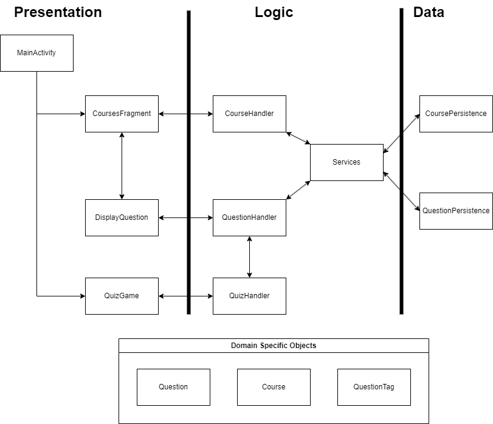
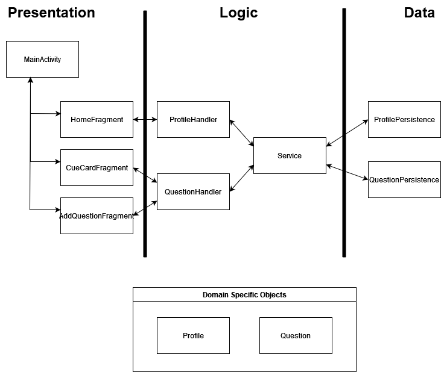
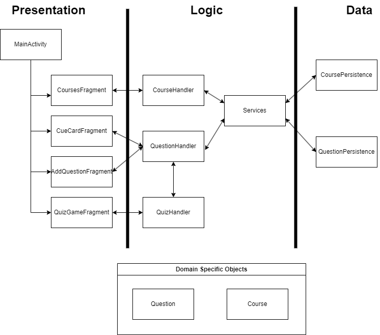

# Architecture

**Directory of Classes and their locations**

## Architecture Diagram

**Iteration 3 Architecture Diagram**

## Application Layer
**MainActivity**
- The main file to load the navigation for the application.

**Services**
- Centralize class that connects the logic layer to the persistence layers.

## Presentation (UI) Layer
**CourseFragment**
- This file is the landing screen when the app is loaded. It will hold the courses for the user.

**DisplayQuestion**
- This file is to view questions. It is accessible through courses.

**QuizGame**
- This file is the view for the quiz game.

## Logic Layer
**QuestionHandler**
- Handles how the Question object interacts between the layers.

**CourseHandler**
- Handles how the Course object interacts between the layers.

**QuizHandler**
- The logic for how the quiz game functions.

**DisplayQuestionTextIterator**
- Handles the logic on how courses are displayed on the presentation layer.

## Data (Persistence) Layer
**IQuestionPersistence**
- The interface for the Question Persistence

**ICoursePersistence**
- The interface for the Course Persistence.

### Databases
**QuestionPersistence**
- Stub. Temporary database for questions.
- HSQLDB. Permanent database that persists after application is closed. 

**CoursePersistence**
- Stub. Temporary database for courses.
- HSQLDB. Permanent database that persists after application is closed.

## Objects (Domain Specific Objects)
**Questions**
- The object that contains a question and an answer.

**Course**
- The object that contains courses.

**QuestionTag**
- The object that gives a course a certain tag.

# History
## Architecture
**Iteration 1 Architecture Diagram**

**Iteration 2 Architecture Diagram**

