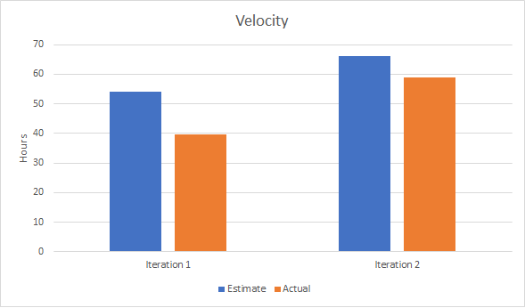

# Iteration 3 Worksheet

## What technical debt has been cleaned up?

**QuestionViewer/CueCards on main menu**

We made a **prudent** and **deliberate** decision to continue to have our cue cards viewable on our iteration 2 release. Our intention was to make each question/cue card have courses tags and have categorized cards behind course selections. However, we did not have enough time to wire our cue cards questions with course tag for the release. We did not want to "hide" the cue cards feature from the user knowing that we will not be able to select it directly from the menu.

[Migrate - 5afa9a98](https://code.cs.umanitoba.ca/3350-summer2023/teameleven-11/-/merge_requests/79)

[Cleanup - 04a191e6](https://code.cs.umanitoba.ca/3350-summer2023/teameleven-11/-/merge_requests/85)

**AddQuestion on the main menu**

We made a **prudent** and **deliberate** decision to have add question a selectable choice on the bottom navigation menu. We wanted the option to add question to be another choice on our cue cards but were not able to fit it into the iteration 2 release. Adding questions to our question bank is still an important feature in our application and we did not want to hide it from the user. 

[Cleanup - 04a191e6](https://code.cs.umanitoba.ca/3350-summer2023/teameleven-11/-/merge_requests/85)

We moved the AddQuestion to the same screen as where we would display the cue cards that is accessible through a floating action button. 

[Fix - eb6a5b52](https://code.cs.umanitoba.ca/3350-summer2023/teameleven-11/-/merge_requests/83)

## What technical debt did you leave?

The ability to add more tags to further categorize and organize the questions added. This will help users to separate their questions by terms, weeks, etc. We made the **prudent** and **deliberate** decision to leave this as debt due to time constraints and the complexity of adding tags while connecting the courses and questions feature. We wanted users to still be able to organize their questions by courses at the very least.

## Discuss a Feature or User Story that was cut/re-prioritized
A feature that we decided to cut was the [Profile](https://code.cs.umanitoba.ca/3350-summer2023/teameleven-11/-/issues/3) feature. We made this decision because the current application is for a single user. We still feel as if [Progress Reports](https://code.cs.umanitoba.ca/3350-summer2023/teameleven-11/-/issues/7) can be a valuable feature by itself and did not need to be directly linked to Profiles. We initially aimed to have this feature complete but did not have our quiz game ready for statistic tracking. We will still not able to get to this feature this iteration as there are still other work that needs to be done such as acceptance tests and completing tag feature.

## Acceptance test/end-to-end
Write a discussion about an end-to-end test that you wrote. What did you test, how did you set up the test so it was not flaky? Provide a link to that test.

TODO:

## Acceptance test, untestable
What challenges did you face when creating acceptance tests? What was difficult or impossible to test?

TODO

## Velocity/teamwork
Our iteration 1 time estimates were a lot higher than the actual time spent. Compared to iteration 2, we found that we were able to better estimate how much time was spent on our development tasks as the difference between estimate and actual hours was smaller. Iteration 1 had some [blockers](https://code.cs.umanitoba.ca/3350-summer2023/teameleven-11/-/merge_requests/10) where we needed some basic ground work for others to get started that took a lot longer than expected to set up. As we began to build the program, the architecture of the application began to come together we were able to leverage what we learned in the earlier iterations and were able to estimate how long a task would take better.

